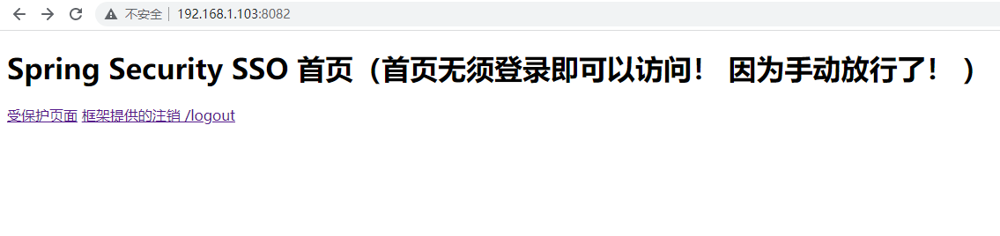
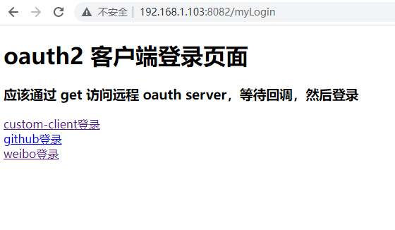
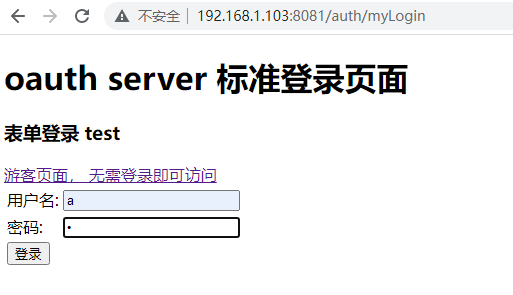
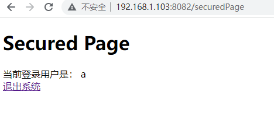

spring_security、 oauth2 学习demo

其中
- AuthorizationServerApplication 是oauth2服务端，包括 认证服务器、资源服务器
- SpringBootOAuthClient 是oauth2客户端
- oauth2-ResourceServer 是oauth2 资源服务器端
- springmvc-demo 是Spring Mvc 学习demo
- learnsecurity001 是Spring Security学习demo

# 版本
spring-boot-starter-parent：2.1.3.RELEASE

# 已经完成
- 支持weibo、github、自定义oauth2服务端等多种方式
- 支持各种自定义登录、登出页
- 支持token存jdbc、redis
- 支持jwt格式token
- token过期自动续签
- 认证服务器资源保护
- 资源服务器分离部署
- 极其丰富的测试用例
- 极其丰富的注释说明
- 关键类、流程源码说明
- 4中认证方式的测试通过
- 各种问题解释说明

# 如何运行？
配置好github、weibo client（不配置的话，使用我的也可以）然后直接启动AuthorizationServerApplication、SpringBootOAuthClientApplication 即可

默认情况下，  
访问 http://192.168.1.103:8082/  是oauth2 客户端  
访问 http://192.168.1.103:8081/auth/  是oauth2 客户端

192.168.1.103 是改成你本地ip，需要局域网ip，不能是localhost 

### 如果需要测试 Spring security 可以单独启动 MyResourceServerApplication

### 如果需要支持资源服务器分离部署, 需要额外的启动 JwtAuthorizationServerApplication

## 效果图
客户端首页  

客户端登录页  

服务端登录页  

客户端访问保护页  

# TODO
- 真正的前后端分离
- 支持微信、抖音、Facebook、Twitter登录
- OpenID、OIDC、Keycloak的支持
- 代码不够清晰，无用代码、注释比较多
- RBAC 
